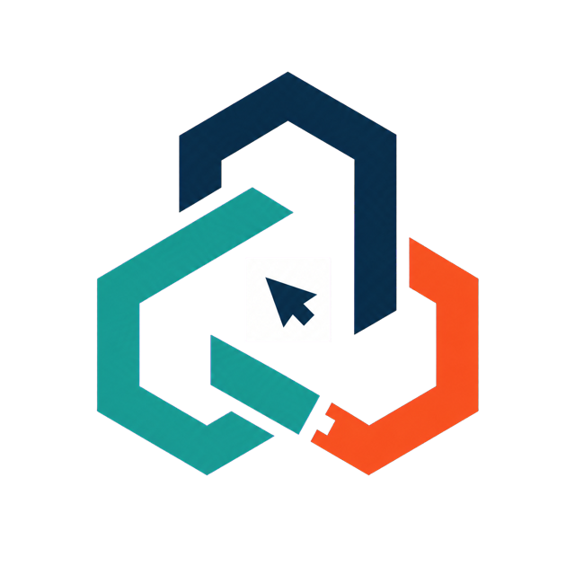
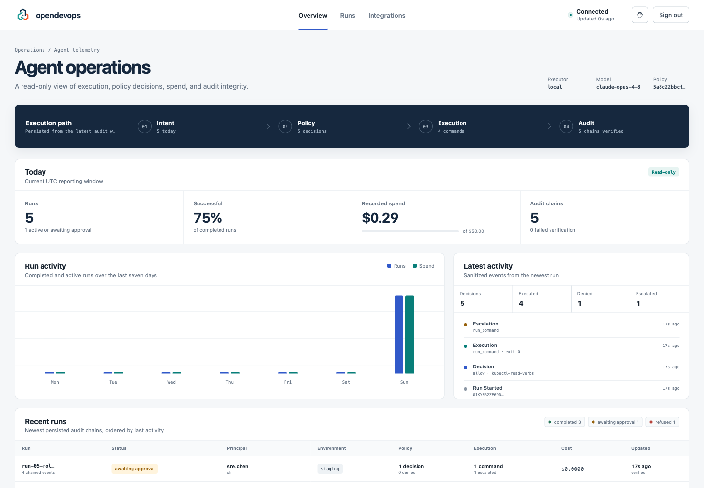
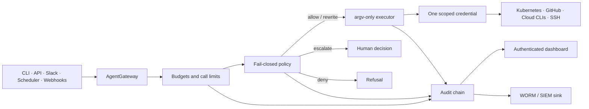

<p align="center">
  
</p>

<h1 align="center">opendevops</h1>

<p align="center">
  <strong>An autonomous DevOps agent with a smaller blast radius than its prompt.</strong>
</p>

<p align="center">
  Investigate infrastructure, diagnose incidents, and perform tightly scoped operations through
  argv-only execution, least-privilege credentials, fail-closed policy, budget stop-losses, and
  structurally verifiable audit chains.
</p>

<p align="center">
  <a href="https://github.com/skundu42/opendevops/actions/workflows/ci.yml"></a>
  <a href="LICENSE"></a>
  
  
</p>

---

## What is opendevops?

opendevops is an open-source operations agent built on LangGraph and LangChain deepagents. It can
trace a CrashLoop, analyze CI failures, inspect cloud resources, verify drift, summarize noisy
logs, and execute a deliberately narrow set of staging remediations.

The model never receives a shell. Every command is an `argv: list[str]` request that passes through
budget controls, a default-deny policy engine, a credential-selection boundary, output scrubbing,
and a per-run audit chain.

```text
you › why is pod api-0 in namespace web crash-looping?
→ run_command kubectl -n web describe pod api-0
→ run_command kubectl -n web logs api-0 --previous --tail 200

The container was OOMKilled (exit 137). Its JVM heap is configured above the
container memory limit. Reduce the heap or raise the workload limit.

spent $0.0841 (run) / $0.34 (today)
```

### Capabilities

| Area | Supported today | Boundary |
|---|---|---|
| Kubernetes | diagnostics, logs, events, Helm inspection | staging mutations only; server dry-run enforced before apply |
| GitHub | CI diagnosis, run inspection, PR-based remediation | repository and API method/path allowlists |
| AWS | curated EC2, ECS, RDS, CloudFormation, S3, Lambda, CloudWatch and related reads | no cloud-resource deployment or IAM access |
| Google Cloud | curated Compute, GKE, Cloud SQL, Pub/Sub, Logging, Storage, Run and Functions reads | mutations and secret access denied |
| Azure | curated VM, AKS, ACR, networking, SQL, Cosmos DB, Monitor and resource reads | mutations and secret material denied |
| Remote hosts | structured, read-only SSH checks | pinned user, key, hosts and `known_hosts` |
| Interfaces | CLI, HTTP, Slack, scheduler, Alertmanager and GitHub webhooks | one shared gateway and safety core |
| Operations UI | authenticated run, policy, cost, integration and audit monitoring | read-only; secret values and command output are never exposed |

> [!IMPORTANT]
> This is not a general AWS, Google Cloud, or Azure deployment engine. Terraform, Pulumi,
> CloudFormation updates, Google Cloud Deploy, ARM/Bicep deployment, and unrestricted provider CLI
> mutations are not enabled.

## Operations dashboard

The service-mode dashboard is a read-only view derived directly from persisted audit chains. It
shows run lifecycle, principals, environments, policy decisions, executions, denials, escalations,
spend, structural integrity, and integration configuration.

<p align="center">
  
</p>

Browser authentication uses a dedicated token exchanged for a short-lived, HMAC-authenticated
HttpOnly cookie. The raw token is never stored in browser storage or returned by an API.

```sh
# service-mode secrets
export POSTGRES_PASSWORD='...'
export GATEWAY_TOKEN='...'
export GRAFANA_ADMIN_PASSWORD='...'
export DASHBOARD_TOKEN='...'

docker compose up -d
open http://localhost:8123/dashboard
```

For production, terminate TLS before Caddy and set
`server.dashboard_cookie_secure: true`. See [deployment](guides/deployment.md#operator-dashboard).

## Why the execution model is different



- **No shell surface.** Commands execute with `shell=False`; interpreters and command-building
  utilities are denied.
- **Credentials are the hard boundary.** The executor constructs a fresh environment and injects
  exactly one credential family for the winning rule and channel.
- **Policy fails closed.** Unknown tools, commands, flags, contexts, identities, and policy errors
  deny execution.
- **Secrets stay out of argv.** Standalone `{{secret:NAME}}` declarations inject environment
  variables for env-aware programs and are removed before execution; embedded expansion is denied.
- **Outputs are scrubbed first.** Known token forms and high-entropy strings are redacted before
  model context, virtual files, or audit excerpts.
- **USD limits are stop-losses.** Call, tool, recursion, and wall-clock limits are hard controls;
  cost is known after model calls and can overshoot by in-flight work.
- **Audit claims are precise.** Local SHA-256 chains prove structural consistency. Authenticity
  requires the independently protected WORM or INSERT-only sink used in production.

Read the full [security model](guides/security-model.md) before connecting real infrastructure.

## Quick start

### Prerequisites

- Python 3.11 or 3.12
- [`uv`](https://docs.astral.sh/uv/)
- `kubectl` and access to a cluster where you can create the agent ServiceAccount
- an Anthropic API key
- optional provider CLIs only for integrations you enable

### Install and configure

```sh
git clone https://github.com/skundu42/opendevops.git
cd opendevops

uv sync --extra checkpoint --extra server --extra dev
cp .env.example .env
# Set ANTHROPIC_API_KEY in .env.

# Provision a read-only, secrets-denied Kubernetes identity.
kubectl apply -f ops/k8s/agent-view-rbac.yaml
ops/k8s/gen-kubeconfig.sh <your-context>

# Add <your-context> to targets.kubernetes.allowed_contexts in config/config.yaml.
uv run opendevops config check
uv run opendevops chat
```

The repository deliberately ships with an empty Kubernetes context allowlist. `config check` and
every runtime entry point refuse to proceed until you make that deployment choice explicitly.

Continue with the [step-by-step getting-started guide](guides/getting-started.md).

## Configuration

Configuration is strict Pydantic over three files:

| File | Purpose |
|---|---|
| [`config/config.yaml`](config/config.yaml) | targets, credential variable names, execution, interfaces and service settings |
| [`config/models.yaml`](config/models.yaml) | agent model aliases and cache-aware pricing |
| [`config/budgets.yaml`](config/budgets.yaml) | per-run profiles, daily stop-losses and counter backend |
| [`config/policy/`](config/policy) | base denies, environment overlays and capability packs |

Unknown keys fail validation. Missing credentials for an enabled policy family fail agent
construction. Secret values belong in the process environment, never YAML.

See the complete [configuration reference](guides/configuration.md).

## Service mode

The included Compose stack runs the LangGraph Server, Postgres, Redis, Caddy, Vector, Prometheus,
Grafana, and the authenticated dashboard:

```sh
uv run langgraph build -t opendevops-langgraph:latest
docker compose config -q
docker compose up -d
```

Security-sensitive Compose credentials have no default values. Caddy is the only ingress; server
APIs and metrics require `GATEWAY_TOKEN`, native webhook routes retain their HMAC/bearer
authentication, and `/dashboard/*` uses the application session described above.

> [!WARNING]
> Never run the service stack on a Kubernetes cluster the agent itself manages. Use a dedicated
> operations VM or a separate operations cluster.

See [deployment](guides/deployment.md) for TLS, shared counters, audit shipping, alerts, backups,
quota planning, and go-live gates.

## CLI

| Command | Purpose |
|---|---|
| `opendevops chat` | streaming REPL with environment, profile and principal selection |
| `opendevops config check` | validate runtime-critical configuration |
| `opendevops audit verify --dir <dir>` | strictly verify audit structure and completion |
| `opendevops audit verify --allow-incomplete` | diagnose structurally valid crashed/in-progress runs |
| `opendevops version` | print the installed version |

## Documentation

| Guide | Contents |
|---|---|
| [Getting started](guides/getting-started.md) | first installation and live session |
| [Architecture](guides/architecture.md) | graph, middleware, gateways, execution and data flow |
| [Configuration](guides/configuration.md) | every supported setting |
| [Policy](guides/policy.md) | rule schema, packs, precedence and extension |
| [Security model](guides/security-model.md) | trust boundaries, failure modes and residual risk |
| [Budgets](guides/budgets.md) | call limits, timeouts, pricing and USD stop-losses |
| [Audit](guides/audit.md) | event schema, verification, shipping and authenticity |
| [Interfaces](guides/interfaces.md) | CLI, dashboard, HTTP, webhooks, Slack and scheduler |
| [Deployment](guides/deployment.md) | service stack, monitoring and production gates |
| [Development](guides/development.md) | tests, conventions and extension points |
| [Upgrade notes](docs/UPGRADE.md) | dependency and migration guidance |

## Development

```sh
uv sync --extra checkpoint --extra server --extra slack --extra ssh --extra dev

uv run pytest -q
uv run ruff check .
uv run mypy src ops
uv lock --check
```

Contributions are welcome. Start with [CONTRIBUTING.md](CONTRIBUTING.md) and the
[development guide](guides/development.md). Please report vulnerabilities privately according to
[SECURITY.md](SECURITY.md).

## License

Licensed under the [Apache License 2.0](LICENSE).
